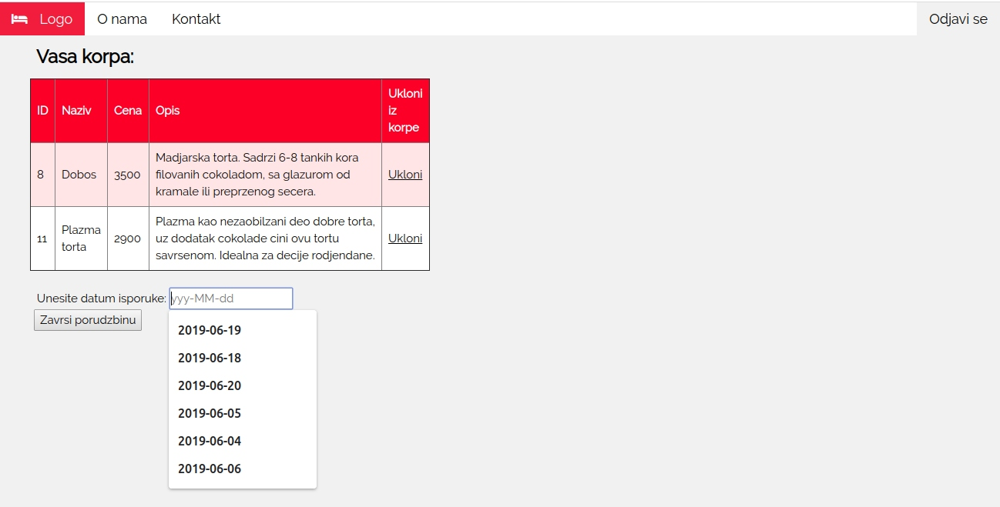
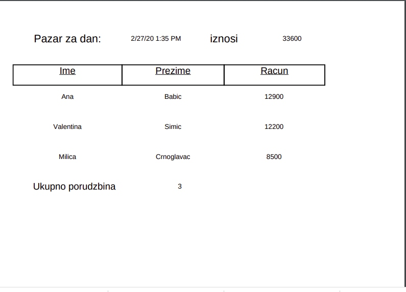

# Pastry Shop - onlinePastryShop-app
> An app that represents online sales within a patisserie.

## Table of contents
* [General info](#general-info)
* [Screenshots](#screenshots)
* [Task](#task)
* [Technologies](#technologies)
* [Functionality](#functionality)
* [Status](#status)
* [Run Locally](#run-locally)

## General info
A classic online sales application expanded to provide services to pastry shop workers
Depending on whether the application is accessed by a user or an administrator, it has two layouts. The consumer is offered the opportunity to shop online, while the administrator has insight into the pastry shop business.

## Screenshots
 
 
 
 
 
 
 
 

## Task
The task of the application is to enable the respondent to answer the survey questions, to store the respondent's answers, where everything will be anonymous. Processing of data obtained through the answers of the respondents and presentation of the data obtained.

## Technologies
* HTML5
* CSS
* JavaScript
* Java, Spring Boot framework-it was used to implement business logic.
* MySql database- Instead of the traditional structure of relational database tables, MongoDB is document-oriented and survey-         friendly.The base was not installed locally and NoSql Booster was used to access the base.

## Functionality
The user accesses the application, after which he can see all active polls and choose which one he wants to answer. After the user completes the survey, all the answers are stored in the database and the results of the selected survey are automatically updated. The user can see the results of all surveys.
A MapReduce was used to implement a slightly more complex method.

## Status
Project is: _finished_

## Run Locally

## Contact
Created by [@ValentinaSimic](https://github.com/ValentinaSimic) - feel free to contact me!

