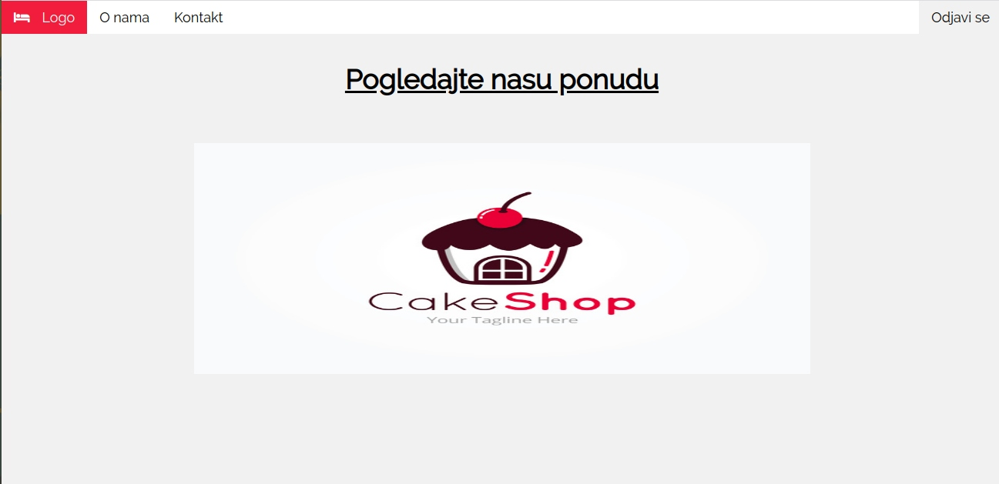

# Pastry Shop - onlinePastryShop-app
> An app that represents online sales within a patisserie.

## Table of contents
* [General info](#general-info)
* [Screenshots](#screenshots)
* [Task](#task)
* [Technologies](#technologies)
* [Functionality](#functionality)
* [Status](#status)
* [Run Locally](#run-locally)

## General info
A classic online sales application expanded to provide services to pastry shop workers
Depending on whether the application is accessed by a user or an administrator, it has two layouts. The consumer is offered the opportunity to shop online, while the administrator has insight into the pastry shop business.

## Screenshots
 
 
 
 
 
 
 
 

## Task
The task of the app is to improve the confectionery business through online sales, as well as to enable workers to more easily manipulate sales

## Technologies
* HTML5
* CSS
* Java, Spring Boot framework-it was used to implement business logic.
* Jasper Report-Is used to generate reports and the tool has been added as an addition to Eclipse.
* MySql- Database is located locally on the computer, MySql Workbench was used for the work.

## Functionality
The user logs in, the data is checked, and the role that the user has is loaded from the database.
The appearance and functionality of the application are different for different roles.
The buyer can review the offer and see feedback from other buyers, and can then choose the cakes to order, after which they can review their cart and order. Admin can perform all weird operations and mark cookies delivered. Admin also gets a current day marketplace as part of a PDF document.

## Status
Project is: _finished_

## Run Locally

## Contact
Created by [@ValentinaSimic](https://github.com/ValentinaSimic) - feel free to contact me!

